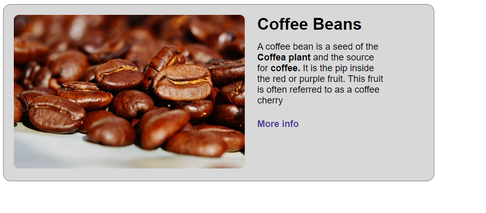

# css selectors

## instructions:

1. no changes should be made inside `<body>` tag.
2. add style.css as the stylesheet for the `index.html` document.
3. add a title to the document: Information Card
4. with css selectors - try to reach this result:

## hints

1. some divs can be reached by using the direct child selector: `>`
2. for the main container - padding and margin should be used.
3. `font-size` should be used to change the font size of some elements
4. distance between elements can be reached with strategic margins.
5. `vertical-align` can be used on inline and inline-block elements to align text to the top of the container.
6. research how to make bold texts
7. research how to remove underline from links
8. colors in use:
 - background color: `#d8d8d8`;
 - border color: `#808080`;
 - link color: `#4f3d9b`;